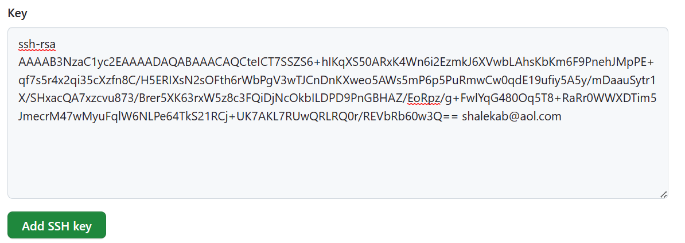

# Connect to github using ssh

First make sure you are in your home directory by typing in command:

```cd```

This should take you to the home directory but if that doesnt work type in:

```cd ..```

Keep using this command until it doesnt go back any more:


Once you are there, we want to type command:

```ls -a```

We do this because we want to see the hidden files there. We are looking for the .ssh directory. If you don't see it or cant find it, then create one using:

```mkdir .ssh```

It should look like


Now ```cd .ssh``` into the .ssh directory. 

Next you want to generate a key pair, these are the keys needed to securley ssh, we have a private key and a public key. Keep the private safe at all times and dont show it to anyone. se the string command:

```ssh-keygen -t rsa -b 4096 -C "<email address>"

When you are propmted where you want the file: that is when you name it:


Then it promts you for a password, these can be blank so press "Enter" twice and move on:


And finally you should see this:


```ls``` and you should see your two keys in there, your private and public, your public key ends with .pub


We finally want the contents of the public key ONLY and make sure it has no spaces either side of the key, so we can connect to git hub and the way to do that is use command:

``cat <key-name.pub>```:


Copy the whole key from "ssh" to and including the email at the end.

### Set up your github

In your overview page, in the top right corner, click the drop down menu and go to settings. Then from there on the left side, select the option for ssh and GPG keys:

.png)

When you are on the page, select "New ssh key".
On the next page, make the "title" the same name as what you named the keys in the bash shell.

keep the "key type" the same "Authentication key"

Then paste your key into the "key" section:



Then click "add ssh key"

### Connecting to github

Next go to you repositories section and create a new repo, mine is "tech230_github_ssh" and use your ssh link to clone the repo locally, using the command:

git clone git@github.com:shalekabh/tech230_github_ssh.git (change the link to your own repo) and now you should have your repo locally to edit in and push back to git hub!

Scongratulations!

